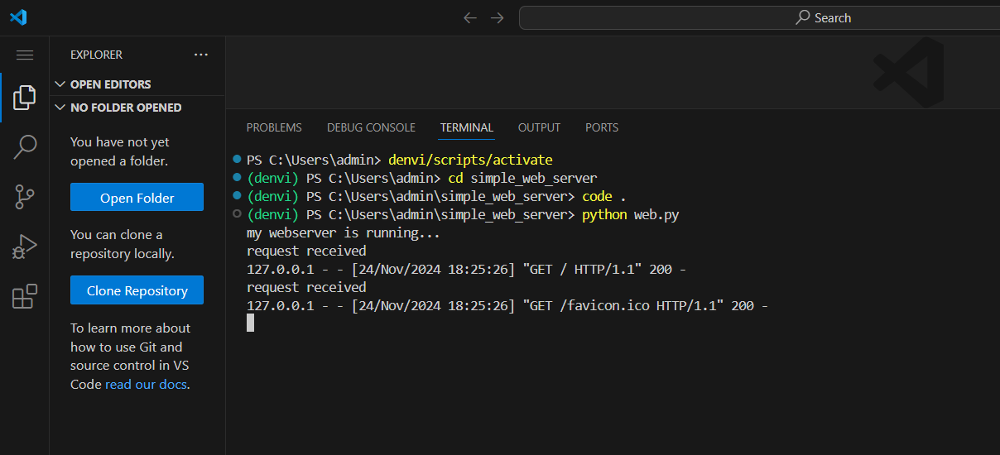

# EX01 Developing a Simple Webserver

# Date:24.11.2024
# AIM:
To develop a simple webserver to serve html pages and display the configuration details of laptop.

# DESIGN STEPS:
## Step 1:
HTML content creation.

## Step 2:
Design of webserver workflow.

## Step 3:
Implementation using Python code.

## Step 4:
Serving the HTML pages.

## Step 5:
Testing the webserver.

# PROGRAM:
```
from http.server import HTTPServer, BaseHTTPRequestHandler
content = """
<DOCTYPE!>
    <html>
        <head>
        <title>My System Configuration</title>

    <style>
        table,th,td {
            border : 5px solid white;
            color : black;
            padding : 30px;
            border-collapse: collapse;
            font-size: 20px;
            
        }

    </style>
    </head>
        <center>
        <body bgcolor="Turquoise">
            <table >
                <caption><h1>DEVICE SPECIFICATIONS</h1></caption>
                <tr>
                    <td><b>Processor</b></td>    <td>13th Gen Intel(R) Core(TM) i5-1335U   1.30 GHz</td>
                </tr>

                    <td><b>   Installed RAM</b></td>	<td>16.0 GB (15.7 GB usable)</td>
                <tr>
                    <td> <b> Device ID	</b></td><td>Product ID	00342-42708-86889-AAOEM</td>
                </tr>
                <tr>
                    <td><b>    System type	64-bit operating system </b></td><td> x64-based processor</td>
                </tr>
                <tr>
                    <td> <b>Pen and touch</b>	</td><td> Pen or touch input is available for this display</td>
                </tr>
        </center>

            </table>
        </body>
    </html>
"""
class myhandler(BaseHTTPRequestHandler):
    def do_GET(self):
        print("request received")
        self.send_response(200)
        self.send_header('content-type','text/html; charset=utf-8')
        self.end_headers()
        self.wfile.write(content.encode())
server_address = ('',8000)
httpd = HTTPServer(server_address,myhandler)
print("my webserver is running...")
httpd.serve_forever()
```
# OUTPUT:

.png>)


# RESULT:
The program for implementing simple webserver is executed successfully.
